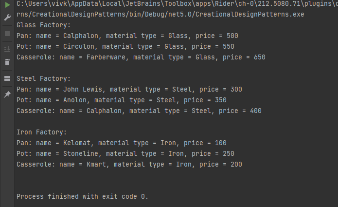

# TMPS Laboratory work nr. 2

## Author: `Volcov Oleg`
## Topic: `Structural Design Patterns`

## Objectives
****
1. Study about **Structural Design Patterns**
2. Expand previous lab and include at least 3 structural design patterns
## Theory
****
In software engineering, **Design patterns** are typical solutions to common 
problems in software design. Each pattern is like a blueprint that can be customized 
to solve a particular design problem.They define a common language that helps 
developer teams communicate more efficiently.

**Design patterns** are concerned with how classes and objects are composed to 
form larger structures. Structural class patterns use inheritance to create a hierarchy 
of classes/abstractions, but the structural object patterns use composition which is 
generally a more flexible alternative to inheritance.

The most known design patterns include:
* **Adapter**
* **Bridge**
* **Composite**
* **Decorator**
* **Facade**
* **Lightweight**
* **Proxy**

## Implemetation
****
In this laboratory work from **Structural design patterns** were implemented 
[***Decorator**, **Adapter**, **Facade***], with the objects of type Cookware 
[*Pan, Pot, Casserole*] and object of type Stove [*Electro-stove, Gas-stove, Steam-stove*]. 
Cookware received a new attribute(4 in total), getters and setters properties, 
and *Info* property used for output, while Stove has same methods, and 3 attributes.

For the **Adapter**, **StoveAdapter** class was implemented using composition
```csharp
public class StoveAdapter : AdapterUtility
{
    private IStove _stove;

    public StoveAdapter(IStove stove)
    {
        _stove = stove;
    }

    public override string Info => _stove.Info;
}
```

To test the results, a new class was made - **Kitchen** with 
the method **Present()** which now can get parameters 
of both Cookware and Stove types, afterwards printing them on screen
```csharp
public void Present(ICookware[] cookwares)
{
    Console.WriteLine("Kitchen contains following cookware");
    foreach (var cookware in cookwares)
    {
        Console.WriteLine(cookware.Info);
    }
}
```

**Facade** allows programmers to hide complex processes of creating 
and customizing objects. For this, I have created **Custom Cookware** 
class, which allow to change the volume and material type used 
when creating the objects.
```csharp
public ICookware GetCustomCookware(string type, float volume, MaterialType materialType)
{
    BaseCookwareFactoryDecorator cutomizer = new CustomVolume(volume, _baseFactory);
    var customCookware = cutomizer.CreateCookware(type);
    customCookware.MaterialType = materialType;
    return customCookware;
}
```

**Decorator** allows us to attach new behaviors by placing 
them in so called wrappers that contains these behaviors. 
For the scope of this lab work, **BaseCookwareFactoryDecorator** 
class was implemented. With its help, the Cookware class was 
expanded with a new attribute - volume, and a new method inside 
**CustomVolume** which can be used to make custom cookware objects. 
By default all of object have a volume of 2 liters.
## Result

