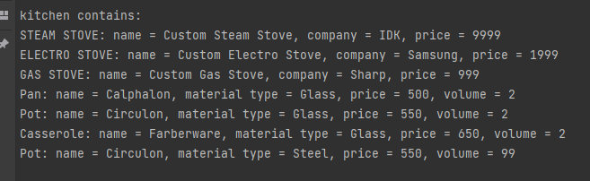

# TMPS Laboratory work nr. 3

## Author: `Volcov Oleg`
## Topic: `Behavioral Design Patterns`

## Last Iterations
****
**[Laboratory Work #1 [Creational]](./Resources/ReadMe/Creational.md)**

**[Laboratory Work #2 [Structural]](./Resources/ReadMe/Structural.md)**
****
## Objectives
****
1. Study about **Behavioral Design Patterns**
2. Expand previous lab and implement as many additional functionalities based on BDP as possible
## Theory
****
In software engineering, **Behavioral patterns** are concerned with the assignment of responsibilities 
between objects, or, encapsulating behavior in an object and delegating requests to it.

By doing so, these patterns increase flexibility in carrying out communication.

The most known design patterns include:
* **Chain of Responsibility**
* **Command**
* **Interpreter**
* **Iterator**
* **Mediator**
* **Observer**
* **Strategy**

## Implemetation
****
Previous lab was expanded by **Iterator** behaviour pattern.

**Iterator** is a design pattern in which an iterator is used to traverse a container and access 
the container's elements. The iterator pattern decouples algorithms from containers, which, 
in some cases, are necessarily container-specific and thus cannot be decoupled.

Implementation can be found in the interfaces **IIterator**:
```csharp
public interface IIterator<out T>
{
    bool MoveNext();
    void Reset();
    
    T Current { get; }
}
```

**IIteratorCollection** and **CookwareIterator** class, 
which would allow me to add new objects to the **Kitchen**.

For printing kitchen components, some instructions from **Main** class is used, which uses this iterator:
```csharp
var iterator = kitchen.Iterator();
iterator.Reset();

while (iterator.MoveNext())
{
    var cookware = iterator.Current;
    if (cookware == null)
        continue;
    
    Console.WriteLine(cookware.Info);
}
```

## Result

